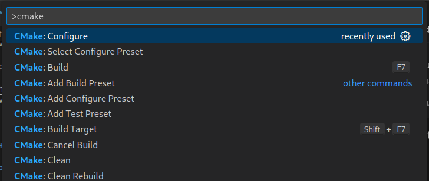
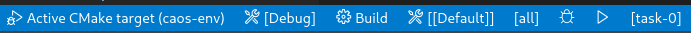

# caos-env

В этом репозитории содержится пример проекта для VSCode, в котором удобно решать
задачи по акосу. Основные фичи:
1. сразу работает дебаг
1. код автоматически форматируется кланг-форматом
1. есть конфигурации сборки с санитайзерами

# Установка

Чтобы все заработало, в системе должны быть установлены `cmake`, `gdb` и
`clang-format`. В VSCode надо добавить плагины [C/C++ Extension
Pack](https://marketplace.visualstudio.com/items?itemName=ms-vscode.cpptools-extension-pack)
и [Clang-Format](https://marketplace.visualstudio.com/items?itemName=xaver.clang-format).

Склонируйте репозиторий и откройте его. 
```bash
$ git clone https://github.com/abramov-ms/caos-env.git
$ cd caos-env
$ code .
```

# Использование

## Сборка проекта

Сначала надо сконфигурировтаь проект симейком. Нажимаем `Ctrl + Shift + P` и в
менюшке выбираем __CMake: Select Configure Preset__.



Доступные пресеты:
1. __Debug.__ Проект будет собираться без оптимизаций и с
отладочными символами.
1. __Release.__ Будут включены оптимизации и выключены
отладочные символы.
1. __ASAN.__ То же самое, что и __Debug__, но дополнительно
включен AddressSanitizer и некоторые другие санитайзеры, которые с ним не
конфликтуют.
1. __TSAN.__ Вместо AddressSanizer включается ThreadSanitizer.

Далее в той же менюшке выбираем __CMake: Configure__. После этого в проекте
появится директория билда для выбранного пресета. Чтобы сбилдить проект, надо
нажать `F7` либо выбрать в меню __CMake: Build__.

Проект надо переконфигурировать каждый раз, когда вы добавляете новые таргеты в
`CMakeLists.txt`.

## Запуск кода и дебаг

В статус-баре снизу можно выбирать конфигурационный пресет, build target и
launch target симейка. Например, на скриншоте выбран пресет __Debug__, build
target __all__ (т.е. собираются все таргеты в проекте) и launch target
__task-0__. 



По `Ctrl + Shift + D` открывается панель для отладки. Всегда будет запускаться
текущий launch target симейка. `Shift + F5` запускает таргет без дебага, просто
`F5` - с дебагом.

## Добавление новых таргетов

Посмотрите, как устроен корневой [CMakeLists.txt](CMakeLists.txt) и
[1-posix-threads/CMakeLists.txt](1-posix-threads/CMakeLists.txt). Добавить новый
контест можно по аналогии с помощью `add_subdirectory()`, новое решение задачи -
через `add_executable()`.

# Примеры работы санитайзеров

Про санитайзеры можно прочитать
[здесь](https://github.com/google/sanitizers/wiki/). В директории
[sanitizers-demo](sanitizers-demo) есть примеры частых багов, которые умеют
отслеживать санитайзеры.
[heap-out-of-bounds.c](sanitizers-demo/heap-out-of-bounds.c) и
[memory-leak.c](sanitizers-demo/memory-leak.c) нужно собирать с пресетом ASAN,
[data-race.c](sanitizers-demo/data-race.c) и
[thread-leak.c](sanitizers-demo/thread-leak.c) - с TSAN. TSAN точно будет
полезен в контестах про pthredas.